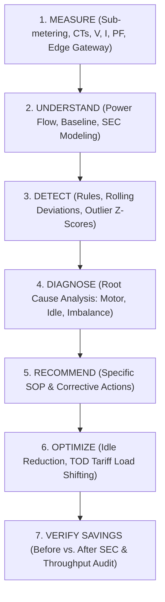
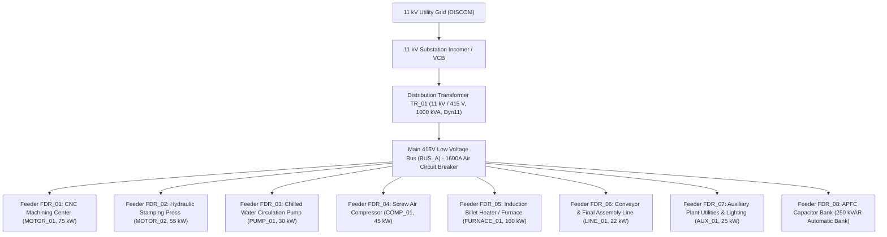
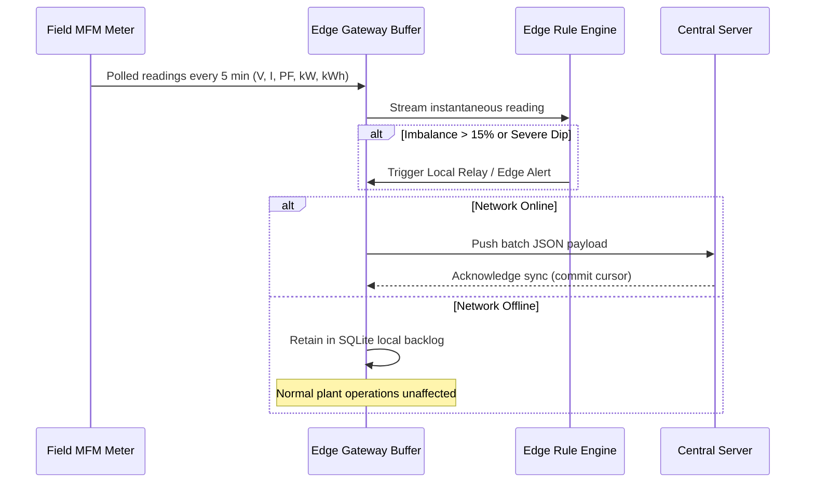
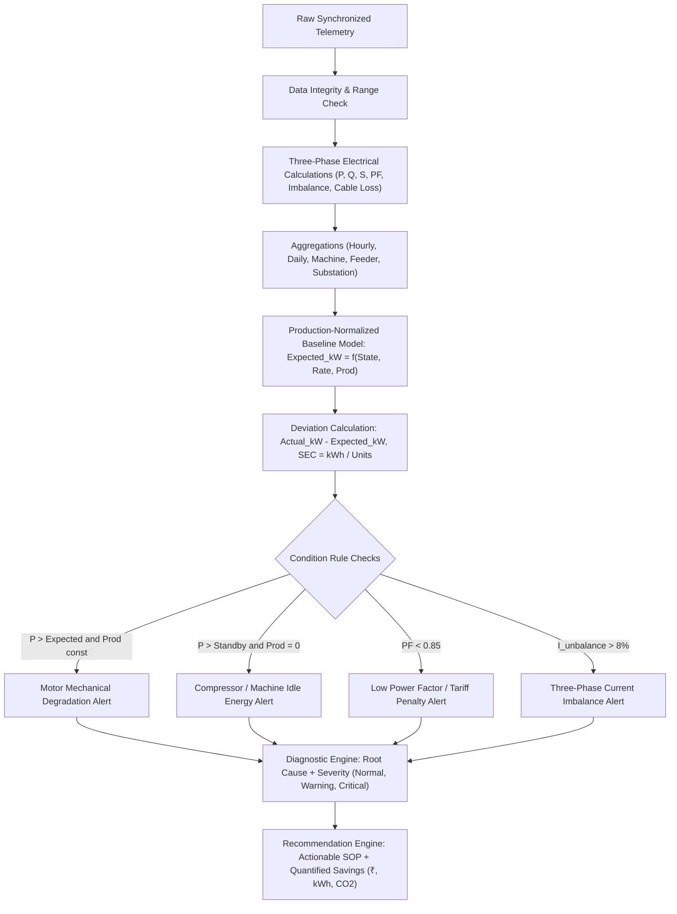
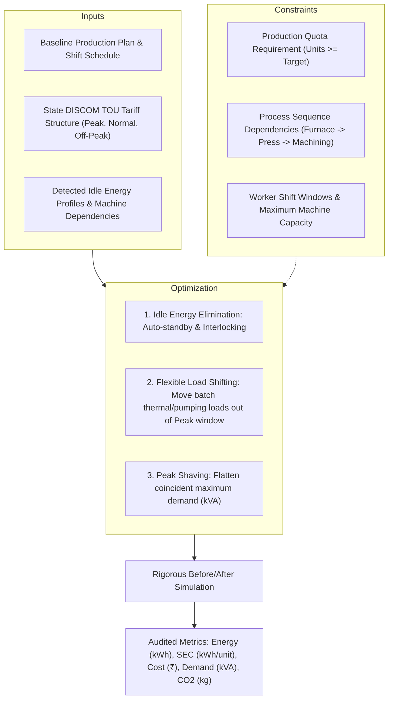

# Factory Energy Intelligence & Optimization Platform - System Architecture

## 1. Executive Summary & Vision

The **Factory Energy Intelligence & Optimization Platform** is an industrial-grade energy analytics, diagnostics, and process optimization system tailored specifically for Indian Small and Medium-sized Enterprises (SMEs). 

Indian manufacturing SMEs operate under tight margins, high Time-of-Day (TOD) industrial tariffs (₹5.00 to ₹12.00+ / kWh), grid voltage fluctuations, and strict production delivery deadlines. Most energy tools in the market are either expensive enterprise EMS suites requiring dedicated energy managers or generic IoT dashboards displaying raw current and kWh without actionable engineering recommendations.

This platform bridges that gap by implementing an automated 7-step engineering intelligence chain:



The platform continuously answers the **Five Core SME Questions**:
1. **WHERE** is electrical energy being consumed? (Feeder/machine level disaggregation)
2. **IS** the consumption normal or abnormal? (Production-adjusted baseline comparison)
3. **WHY** is abnormal consumption occurring? (Root cause diagnostics: idle run, phase unbalance, degradation)
4. **WHAT** action should the plant engineer/operator take? (Contextual, quantified recommendations)
5. **DID** the action actually reduce Specific Energy Consumption (SEC) without degrading production throughput? (Rigorous before/after verification)

---

## 2. Factory Electrical Single-Line Topology

The generic Indian SME manufacturing facility (e.g., auto-component machining & heat treatment plant) receives power at 11 kV from the state distribution utility (DISCOM), stepped down to 415 V via a 1000 kVA distribution transformer.



---

## 3. End-to-End Data Pipeline Architecture

```mermaid
flowchart LR
    subgraph Floor["Shop Floor & Field Sensors"]
        Meters["Digital Multifunction Meters (MFMs) + CTs"]
        VibTemp["Vibration & Surface Temp Sensors"]
        PLC["PLC Cycle / Part Counters"]
    end

    subgraph Edge["Affordable Edge Gateway (Raspberry Pi / Industrial PC)"]
        Modbus["RS-485 Modbus RTU / TCP Master"]
        LocalBuffer["Local SQLite Buffer & Circular Cache"]
        EdgeRules["Edge Anomaly Detection & L1 Health Engine"]
    end

    subgraph Backend["Central Processing & Analytics Service"]
        Ingest["Data Ingestion & Integrity Validation API"]
        BaselineEngine["Energy Baseline & SEC Engine"]
        DiagEngine["Rule & Statistical Diagnostics Engine"]
        OptEngine["Idle & TOU Scheduling Optimizer"]
    end

    subgraph Presentation["User Touchpoints"]
        UI["Streamlit Interactive Operations Dashboard"]
        RestAPI["FastAPI REST Endpoints"]
        Alerts["Operator Notification Stream"]
    end

    Meters -->|RS-485 / Modbus| Modbus
    VibTemp -->|4-20mA / IO-Link| Modbus
    PLC -->|Digital Pulse / MQTT| Modbus
    Modbus --> LocalBuffer
    LocalBuffer --> EdgeRules
    LocalBuffer -->|Store & Forward (MQTT/HTTPS)| Ingest
    Ingest --> BaselineEngine
    Ingest --> DiagEngine
    BaselineEngine --> OptEngine
    DiagEngine --> UI
    OptEngine --> UI
    Ingest --> RestAPI
    DiagEngine --> Alerts
```

---

## 4. Edge-Computing Resilience for Indian SME Environments

Many SME manufacturing clusters in India (e.g., Peenya, Bhosari, Sanand, Ambattur) experience periodic broadband outages and electrical transients. The architecture incorporates:

1. **Store-and-Forward SQLite Buffer**: High-frequency 5-minute electrical telemetry is buffered locally on flash storage (up to 30 days retention).
2. **Local Anomaly Screening**: Safety-critical thresholds (current imbalance >15%, phase loss, extreme power factor dip <0.75, thermal limit exceedance) trigger immediate edge audio-visual alerts without cloud dependency.
3. **Resilient Synchronization**: Upon network restoration, data is batched, compressed, and synchronized with deduplication guarantees.



---

## 5. Analytics & Diagnostics Workflow

The analytics engine processes discrete synchronized intervals ($\Delta t = 5\text{ min} = 0.0833\text{ hr}$):



---

## 6. Optimization Workflow



---

## 7. Deployment Architecture (Scalability Path)

The deployment model scales gracefully from single-machine trial to enterprise multi-site operations:

* **Stage 1 (Single Production Cell Pilot)**: 1 Gateway, 5 Meters, local dashboard. Validates sensor accuracy and demonstrates quick-win idle savings within 14 days.
* **Stage 2 (Single Factory Deployment)**: 15-30 Meters across all feeders, full MDB monitoring, local edge server running FastAPI + SQLite + Streamlit.
* **Stage 3 (Multi-Site SME Cluster)**: Centralized cloud database (PostgreSQL/TimescaleDB), multi-tenant plant benchmarking, cross-facility SEC leaderboards.
