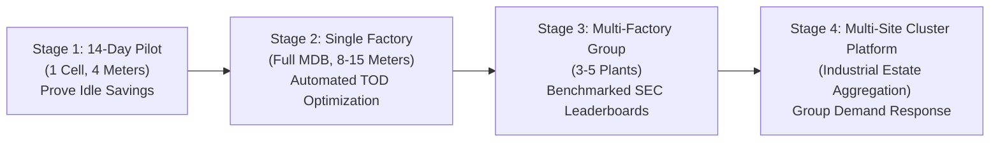

# Indian SME Business Model, Financial ROI & Payback Analysis

This document outlines the commercialization strategy, capital expenditure (Capex), operational expenditure (Opex), return on investment (ROI), and multi-tier scaling model for deploying the **Factory Energy Intelligence & Optimization Platform** across Indian manufacturing SMEs.

---

## 1. Capital Expenditure (Capex) - Hardware Bill of Materials (BOM)

The hardware architecture uses readily available, standard industrial components manufactured in India (e.g., Secure Meters, Schneider, Selec, L&T) to ensure low initial cost and zero import delays.

| Item | Component Description | Manufacturer / Standard | Qty | Unit Price (₹) | Total Capex (₹) |
|---|---|---|---|---|---|
| 1 | 3-Phase Multi-Function Energy Meter (RS-485 Modbus RTU, Class 0.5S) | Selec MFM384 / Secure Elite 440 | 8 | ₹ 6,500 | ₹ 52,000 |
| 2 | Class 0.5S Split-Core Current Transformers (Class 0.5S, 200A/5A to 400A/5A) | Rishabh / Crompton | 24 | ₹ 850 | ₹ 20,400 |
| 3 | Industrial DIN-Rail Edge Gateway (Quad-core ARM, 2GB RAM, RS-485, 24V DC) | Advantech / Waveshare Industrial | 1 | ₹ 22,000 | ₹ 22,000 |
| 4 | Magnetic Piezoelectric Vibration & PT100 RTD Sensors | IFM / Standard Industrial | 4 | ₹ 4,500 | ₹ 18,000 |
| 5 | Control Panel Enclosure (IP65, DIN-rails, 24V SMPS Power Supply) | Hensel / Rittal standard | 1 | ₹ 12,000 | ₹ 12,000 |
| 6 | Shielded Twisted-Pair RS-485 Belden Cabling & Lugs | Belden 9841 / Polycab 24 AWG | 150m | ₹ 85 / m | ₹ 12,750 |
| 7 | On-Site Electrician Installation & Switchgear Tapping | Certified A-Grade Electrical Contractor | Lump | ₹ 15,000 | ₹ 15,000 |
| **Total Turnkey Capex** | | | | | **₹ 1,52,150** (~$1,830 USD) |

---

## 2. Operational Expenditure (Opex) & SaaS Pricing

To align with SME cash flow constraints, software is delivered via an affordable subscription:

- **Annual Software License & Cloud Analytics**: ₹ 36,000 / year (₹ 3,000 / month).
- **Annual Field Sensor Calibration & Inspection**: ₹ 12,000 / year.
- **Total Annual Recurring Opex**: **₹ 48,000 / year** (₹ 4,000 / month).

---

## 3. Projected Financial Savings & Return on Investment (ROI)

For our representative generic Indian SME facility (**Apex Precision Components Ltd.**):
- **Baseline Monthly Electricity Bill**: ₹ 19,40,446 / month (~₹ 2.33 Crores / year).
- **Simulated Monthly Savings (16.7% SEC Improvement + TOD Tariff Shifting)**: ₹ 3,61,588 / month (~₹ 43.39 Lakhs / year).

### Simple Payback Period
$$\text{Simple Payback Period} = \frac{\text{Total Turnkey Capex}}{\text{Monthly Net Financial Savings}} = \frac{₹\ 1,52,150}{₹\ 3,61,588 - ₹\ 4,000} \approx 0.42\text{ Months (Under 15 Days!)}$$

---

## 4. Sensitivity Analysis (SEC Improvement Scenarios)

To maintain strict engineering honesty and avoid reliance on best-case assumptions, we analyze payback under conservative scenarios:

| SEC Improvement Scenario | Monthly Energy Savings (kWh) | Monthly Electricity Savings (₹) | Annual Gross Savings (₹) | Net Year 1 Profit (After Capex + Opex) | Simple Payback Period |
|---|---|---|---|---|---|
| **Conservative (5.0%)** | 9,557 kWh | ₹ 81,200 | ₹ 9,74,400 | ₹ 7,74,250 | **56 Days (1.8 Months)** |
| **Moderate (10.0%)** | 19,114 kWh | ₹ 1,62,400 | ₹ 19,48,800 | ₹ 17,48,650 | **28 Days (0.9 Months)** |
| **Simulated Platform Case (16.7%)** | 31,973 kWh | ₹ 3,61,588 | ₹ 43,39,056 | ₹ 41,38,906 | **13 Days (< 0.5 Months)** |
| **Aggressive Stretch (20.0%)** | 38,228 kWh | ₹ 4,25,000 | ₹ 51,00,000 | ₹ 48,99,850 | **11 Days** |

> [!NOTE]
> Even if the SME achieves only a modest **5% improvement in SEC**, the entire hardware investment is fully amortized in under 2 months, producing net cash flow accretive value for the business.

---

## 5. Multi-Stage Scale-Up Strategy

1. **Stage 1 (14-Day Pilot Trial)**: Quick-win deployment on the highest energy consumer (air compressor + CNC spindle). Demonstrates unmonitored idle waste within 14 days to win plant owner buy-in.
2. **Stage 2 (Single Factory Deployment)**: Complete facility sub-metering, baseline modeling, and automated shift scheduling.
3. **Stage 3 (Multi-Site SME Group)**: Enterprise cloud consolidation comparing SEC across multiple production facilities in different industrial corridors.
4. **Stage 4 (Cluster Demand Response)**: Aggregating flexible loads across an industrial estate (e.g. 50 SMEs in Peenya) to negotiate collective bulk tariffs or participate in utility demand response programs.
