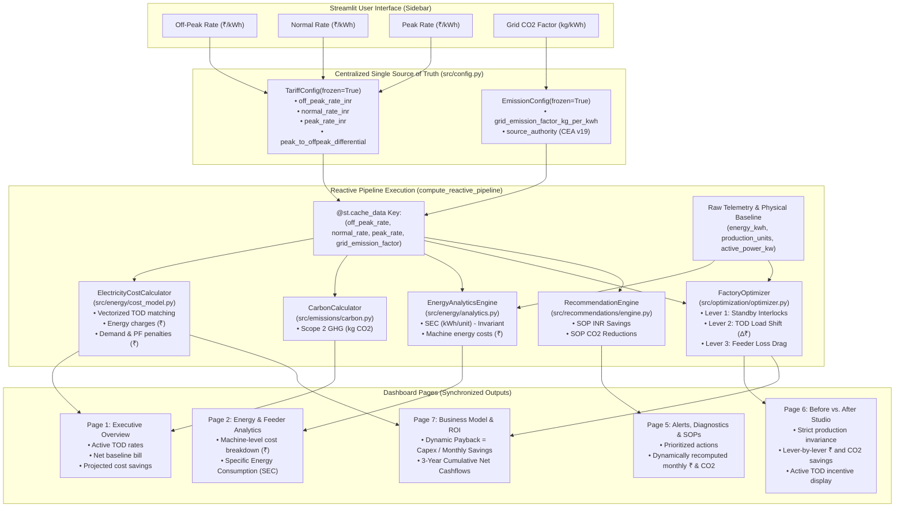

# Configuration Dependency & Reactive Data Flow Architecture

## 1. Overview & Objective

The **Factory Energy Intelligence & Optimization Platform** is designed for Indian Small and Medium Enterprises (SMEs) to optimize energy costs and carbon emissions under volatile industrial Time-of-Day (TOD) tariffs without risking production throughput.

A critical design requirement is **reactive end-to-end configuration propagation**: when a plant manager, energy auditor, or SME executive adjusts economic parameters (Off-Peak, Normal, Peak tariffs) or environmental metrics (Grid CO2 emission factor) in the dashboard sidebar, the entire calculation, optimization, recommendation, and financial payback pipeline must update dynamically in real time without stale caches or static precomputed lookups.

Equally critical is the **Principle of Physical-Economic Decoupling**:
- **Tariff rate changes** must strictly alter monetary costs and financial incentives, and **MUST NOT** alter physical active power, energy consumption (kWh), production units, or Specific Energy Consumption (SEC).
- **Carbon factor changes** must strictly alter greenhouse gas emission totals and avoided emissions, and **MUST NOT** alter energy consumption, production, SEC, or monetary costs.

---

## 2. End-to-End Reactive Data Flow Diagram



---

## 3. Dependency Mapping Matrix

The table below traces each configurable parameter from its UI origin through internal data structures to the downstream business logic and UI presentation layer:

| Input Parameter | Source Code Location | Intermediate Config Object | Consuming Engine Classes | Downstream Dependent Metrics | Invariance Boundary (Must NOT Alter) |
| :--- | :--- | :--- | :--- | :--- | :--- |
| **Off-Peak Rate** (`₹/kWh`) | `dashboard/app.py` (line 200) | `TariffConfig.off_peak_rate_inr` | `ElectricityCostCalculator`, `FactoryOptimizer`, `EnergyAnalyticsEngine`, `RecommendationEngine` | • Night slot energy cost (₹)<br>• Baseline total bill (₹)<br>• Optimized total bill (₹)<br>• Peak-to-offpeak spread ($\Delta ₹$)<br>• Tariff shift savings (₹)<br>• Payback period (Months) | • Machine active power (kW)<br>• Energy consumption (kWh)<br>• Production throughput (Units)<br>• SEC (kWh/unit)<br>• Scope 2 emissions (kg CO2) |
| **Normal Day Rate** (`₹/kWh`) | `dashboard/app.py` (line 201) | `TariffConfig.normal_rate_inr` | `ElectricityCostCalculator`, `EnergyAnalyticsEngine`, `RecommendationEngine`, `FactoryOptimizer` | • Day slot energy cost (₹)<br>• Idle elimination savings (₹)<br>• Conductor loss cost (₹)<br>• SOP action monthly savings (₹) | • Active power (kW)<br>• Energy consumption (kWh)<br>• Production throughput (Units)<br>• SEC (kWh/unit)<br>• Scope 2 emissions (kg CO2) |
| **Evening Peak Rate** (`₹/kWh`) | `dashboard/app.py` (line 202) | `TariffConfig.peak_rate_inr` | `ElectricityCostCalculator`, `FactoryOptimizer`, `EnergyAnalyticsEngine` | • Peak slot energy cost (₹)<br>• Peak-to-offpeak spread ($\Delta ₹$)<br>• Load shifting financial incentive<br>• Optimized electricity bill (₹)<br>• Annual cost savings (₹)<br>• Simple payback period | • Active power (kW)<br>• Energy consumption (kWh)<br>• Production throughput (Units)<br>• SEC (kWh/unit)<br>• Scope 2 emissions (kg CO2) |
| **Grid CO2 Factor** (`kg/kWh`) | `dashboard/app.py` (line 203) | `EmissionConfig.grid_emission_factor_kg_per_kwh` | `CarbonCalculator`, `FactoryOptimizer`, `RecommendationEngine` | • Baseline carbon footprint (kg CO2)<br>• Optimized carbon footprint (kg CO2)<br>• Avoided emissions (kg CO2)<br>• Annual GHG reduction (t CO2)<br>• SOP CO2 abatement potential | • Physical energy (kWh)<br>• Active power (kW)<br>• Production throughput (Units)<br>• Specific Energy Consumption (SEC)<br>• Electricity costs (₹)<br>• Payback period (Months) |

---

## 4. Mathematical Formulations & Propagation Logic

### 4.1. Time-of-Day (TOD) Energy Cost Calculation
Energy consumption is partitioned into discrete Time-of-Day slots based on clock hour $t$:
$$\text{Slot}(t) = \begin{cases} 
\text{PEAK} & \text{if } 18 \le t < 22 \\ 
\text{OFF\_PEAK} & \text{if } t \ge 22 \text{ or } t < 6 \\ 
\text{NORMAL} & \text{if } 6 \le t < 18 
\end{cases}$$

The total energy cost for interval $i$ is calculated dynamically:
$$\text{Cost}_i = E_i \times \text{Rate}(\text{Slot}_i)$$
$$\text{Total Energy Charge} = \sum_{i=1}^{N} \text{Cost}_i = R_{\text{off}} \sum_{i \in \text{off}} E_i + R_{\text{norm}} \sum_{i \in \text{norm}} E_i + R_{\text{peak}} \sum_{i \in \text{peak}} E_i$$

### 4.2. Economic Dispatch & Tariff Load Shifting
The financial incentive for shifting flexible batch operations (e.g., Heat Treatment Electric Arc Furnace `FURNACE_01`) out of the evening peak slot is determined by the active spread:
$$\Delta_{\text{TOD}} = R_{\text{peak}} - R_{\text{off}}$$

In `FactoryOptimizer.optimize_tariff_load_shifting()`:
- **Case 1: Positive Differential ($\Delta_{\text{TOD}} > 0$)**: Flexible batch energy $E_{\text{shift}}$ is rescheduled from Peak to Off-Peak hours. 
  $$\text{Savings}_{\text{shift}} = E_{\text{shift}} \times (R_{\text{peak}} - R_{\text{off}})$$
- **Case 2: Flat or Inverted Tariff ($\Delta_{\text{TOD}} \le 0$)**: 
  $$\text{Savings}_{\text{shift}} = 0.00\text{ ₹}$$
  Flexible loads remain in their scheduled time slots since there is zero economic benefit to justify rescheduling disruption.

### 4.3. Specific Energy Consumption (SEC) Invariance
Specific Energy Consumption is the fundamental engineering KPI of the plant:
$$\text{SEC} = \frac{\sum_{i=1}^{N} E_i}{\sum_{i=1}^{N} \text{Production}_i} \quad \left[\frac{\text{kWh}}{\text{unit}}\right]$$

Because $\text{SEC}$ is an exclusively physical ratio between kilowatt-hours and manufactured units:
$$\frac{\partial \text{SEC}}{\partial R_{\text{off}}} = 0, \quad \frac{\partial \text{SEC}}{\partial R_{\text{norm}}} = 0, \quad \frac{\partial \text{SEC}}{\partial R_{\text{peak}}} = 0, \quad \frac{\partial \text{SEC}}{\partial \text{CO2\_factor}} = 0$$

### 4.4. Scope 2 Carbon Emissions
$$\text{Emissions} = \left(\sum_{i=1}^{N} E_i\right) \times \text{CO2\_factor} \quad \left[\text{kg CO}_2\right]$$
$$\text{Avoided Emissions} = \Delta E_{\text{physical}} \times \text{CO2\_factor} \quad \left[\text{kg CO}_2\right]$$

Note that load shifting between time slots changes the *cost* of energy, but does **not** alter total energy consumption ($E_{\text{shift}}$ is conserved); hence load shifting alone produces zero direct carbon reduction under a uniform grid factor, while idle reduction and cable loss minimization deliver verifiable carbon abatement.

### 4.5. Dynamic Payback Period
In `dashboard/app.py` Page 7 and the financial business model:
$$\text{Monthly Financial Savings} = \text{Cost}_{\text{baseline}} - \text{Cost}_{\text{optimized}}$$
$$\text{Payback Period (Months)} = \frac{\text{Platform Hardware \& Deployment Capex (₹)}}{\text{Monthly Financial Savings (₹/month)}}$$

When electricity tariff rates increase, monthly rupee savings increase proportionally, causing the calculated payback period to contract dynamically in real time.

---

## 5. Reactive Cache Management

### 5.1. Cache Key Formulation
To eliminate stale computation artifacts, the primary evaluation pipeline is wrapped in Streamlit's `@st.cache_data` with all 4 user-controllable parameters forming the cache key:

```python
@st.cache_data
def compute_reactive_pipeline(
    off_peak_rate: float,
    normal_rate: float,
    peak_rate: float,
    grid_emission_factor: float
):
    # Instantiates immutable config dataclasses
    t_cfg = TariffConfig(off_peak_rate_inr=off_peak_rate, normal_rate_inr=normal_rate, peak_rate_inr=peak_rate)
    e_cfg = EmissionConfig(grid_emission_factor_kg_per_kwh=grid_emission_factor)

    # Injects configurations into all analytical engines
    cost_calc = ElectricityCostCalculator(config=t_cfg)
    carbon_calc = CarbonCalculator(config=e_cfg)
    optimizer = FactoryOptimizer(cost_calculator=cost_calc, carbon_calculator=carbon_calc)
    analytics = EnergyAnalyticsEngine(cost_calculator=cost_calc)
    rec_engine = RecommendationEngine(tariff_config=t_cfg, emission_config=e_cfg)

    # Recomputes full optimization, machine breakdowns, and recommendations
    df_opt, comparison = optimizer.run_full_optimization(df_base)
    machine_summary_base = analytics.summarize_by_machine(df_base)
    machine_summary_opt = analytics.summarize_by_machine(df_opt)
    recs = rec_engine.generate_recommendations(df_incidents, df_health)

    return df_base, df_opt, comparison, df_incidents, df_health, machine_summary_base, machine_summary_opt, recs, t_cfg, e_cfg, recalc_timestamp
```

### 5.2. Elimination of Static Disk JSON Lookups
Previously, `dashboard/app.py` read precomputed metrics from `data/processed/optimization_comparison.json`. When sidebar sliders moved, the UI reread this frozen JSON file, completely ignoring the new values. 

In the updated architecture, `compute_reactive_pipeline()` executes in-memory transformations directly on telemetry data using the injected `t_cfg` and `e_cfg`. Static JSON files are preserved solely as cold-start fallback caches and are bypassed when reactive parameters are actively supplied.

---

## 6. Verification and Regression Testing

The integrity of this reactive pipeline is formally verified by the automated test suite in `tests/test_reactive_config.py`:

1. **`test_test1_baseline_tod_tariff_recording`**: Confirms mathematical precision of TOD slot multiplications under standard tariffs ($₹5.00 / ₹8.00 / ₹12.00$).
2. **`test_test2_flat_tariff_no_tod_differential`**: Confirms that when all slots are equal ($₹8.00 / ₹8.00 / ₹8.00$), the TOD differential drops to $0.00\text{ ₹}$, and tariff load shifting savings evaluate strictly to $0.00\text{ ₹}$.
3. **`test_test3_high_peak_tariff_stronger_shift_incentive`**: Confirms that increasing peak rate from $₹12.00$ to $₹20.00$ increases baseline peak cost and amplifies load shifting financial savings.
4. **`test_test4_co2_factor_shift_invariance`**: Confirms that changing the grid CO2 factor from $0.716$ to $0.500\text{ kg/kWh}$ causes emissions to drop by exactly $30.17\%$, while energy (kWh), production, SEC, and electricity cost (₹) remain strictly identical.
5. **`test_test5_tariff_rate_change_invariance`**: Confirms that changing the off-peak rate from $₹5.00$ to $₹10.00$ increases electricity cost while energy, production, SEC, and Scope 2 CO2 remain strictly identical.
6. **`test_test6_optimizer_schedule_comparison_flat_vs_tod`**: Confirms that the optimizer halts furnace rescheduling under flat tariffs, but actively shifts furnace operation under steep TOD tariffs.
