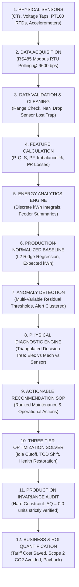

# Factory Energy Intelligence & Optimization Platform
## End-to-End Data Flow Specification

**Document Version:** 1.0 (Frozen Release)  
**Data Cycle Rate:** 5-minute telemetry intervals (300 seconds)  
**Master Dataset Size:** 60,480 telemetry records across 7 feeders (30-day canonical period)  

---

## 1. High-Level Cyber-Physical Data Flow Pipeline

The system transforms raw analog sensor measurements into audited enterprise business impact through a 12-stage sequential data pipeline:

---

## 2. Stage-by-Stage Engineering Transformation

### Stage 1: Physical Sensors
- **Inputs:** 3-phase line conductors, machine bearing housings, motor stator casings.
- **Physical Quantities:** Secondary current signals ($0\text{–}5\text{ A}$ AC from split-core CTs), step-down line voltages ($415\text{ V}$ AC line-to-line), RTD resistance changes ($100\ \Omega\text{ at }0^\circ\text{C}$), piezoelectric charge output proportional to acceleration.
- **Frequency:** Continuous analog signals.

### Stage 2: Data Acquisition
- **Mechanism:** Edge gateway queries 8 slave meters sequentially over RS485 2-wire serial daisy chain using standard Modbus RTU function code `0x03` (Read Holding Registers).
- **Registers Polled:** Voltage line-to-line, phase currents $I_R, I_Y, I_B$, total active power $P$, total apparent power $S$, power factor, frequency, total active energy import.
- **Interval:** Telemetry packet logged every 300.0 seconds (5 minutes).

### Stage 3: Data Validation & Pre-Screening
- **Validation Rules:**
  - Range validation: $300\text{ V} \le V_{\text{line}} \le 480\text{ V}$, $0.0\text{ A} \le I_{\text{avg}} \le 1200\text{ A}$.
  - Non-negativity check: Active power $P \ge 0.0\text{ kW}$ (no unmetered reverse feed).
  - Current Sensor Lost Trap:
    $$\text{If } \min(I_R, I_Y, I_B) < 0.5\text{ A} \quad \text{AND} \quad \max(I_R, I_Y, I_B) > 15.0\text{ A}:$$
    $$\text{Flag: } \texttt{DATA\_QUALITY\_CURRENT\_SENSOR\_LOST} \quad (\text{Suppress False Contactor Alarms})$$
- **Output:** Cleaned telemetry record; records failing bounds are logged to a dead-letter quarantine table.

### Stage 4: Feature Calculation & Physical Transformations
- **Vector Calculations:**
  - True RMS Apparent Power: $S = \sqrt{3} \cdot V_{\text{line}} \cdot I_{\text{avg}} \cdot 10^{-3} \ [\text{kVA}]$
  - Reactive Power: $Q = \sqrt{\max(0, S^2 - P^2)} \ [\text{kVAR}]$
  - Operating Power Factor: $\text{PF} = \text{clip}\left(\frac{P}{S}, 0.10, 1.00\right)$
  - NEMA Phase Current Imbalance:
    $$I_{\text{imb}} = \frac{\max(|I_R - I_{\text{avg}}|, |I_Y - I_{\text{avg}}|, |I_B - I_{\text{avg}}|)}{I_{\text{avg}}} \times 100 \ [\%]$$
  - Estimated Cable Joule Losses:
    $$P_{\text{cable}} = 3 \cdot I_{\text{avg}}^2 \cdot R_{\text{feeder}}(50^\circ\text{C}) \cdot 10^{-3} \ [\text{kW}]$$

### Stage 5: Energy Analytics & Aggregation
- **Discrete Energy Integration:**
  $$E_{\text{interval}} = P \cdot \left(\frac{5.0}{60.0}\right) \ [\text{kWh}]$$
- **Time-of-Day Tariff Slot Tagging:**
  - `OFF_PEAK`: 22:00 – 06:00 (₹5.20 / kWh)
  - `NORMAL`: 06:00 – 18:00 (₹7.80 / kWh)
  - `PEAK`: 18:00 – 22:00 (₹11.50 / kWh)
- **Specific Energy Consumption (SEC):**
  $$\text{SEC} = \begin{cases} \frac{E_{\text{interval}}}{Q_{\text{prod}}} & \text{if } Q_{\text{prod}} > 0 \\ \texttt{None} \ (\text{"N/A (Utility)"}) & \text{if } Q_{\text{prod}} \le 0 \end{cases}$$

### Stage 6: Production-Normalized Baseline Generation
- **Algorithm:** L2-regularized Ridge Regression ($\alpha=1.0$).
- **Features:** Production throughput ($Q_{\text{prod}}$), machine operating status indicator, diurnal harmonics ($\sin/\cos$ hour of day), ambient temperature.
- **Model Output:** $P_{\text{expected}}$ and $E_{\text{expected}}$ representing what an optimal machine should consume for the exact observed production throughput.

### Stage 7: Statistical & Physical Anomaly Detection
- **Residual Computation:**
  $$\Delta P = \frac{P_{\text{actual}} - P_{\text{expected}}}{P_{\text{expected}}} \times 100 \ [\%]$$
- **Multi-Variable Trigger Criteria:**
  - Machine Degradation: $\Delta P > 12.0\%$ continuous for $> 30\text{ minutes}$ while $Q_{\text{prod}} > 0$.
  - Idle Power Runaway: $P > 5.0\text{ kW}$ continuous while $Q_{\text{prod}} = 0$ for $> 15\text{ minutes}$.
  - Power Factor Warning: $\text{PF} < 0.85$.
  - Phase Imbalance: $I_{\text{imb}} > 5.0\%$ (Warning), $> 12.0\%$ (Critical).
- **Incident Clustering:** Temporal clustering merges consecutive 5-minute alarm hits into consolidated incident episodes.

### Stage 8: Physical Diagnostic Triage
- **Cross-Sensor Fusion:**
  - Evaluates vibration velocity RMS against ISO 10816-3 limits ($2.8\text{ mm/s}$ limit).
  - Evaluates bearing surface temperature rise ($+10^\circ\text{C}$ rise limit).
  - Evaluates 3-phase voltage balance to differentiate internal machine faults from supply switchgear contactor loosening.
- **Diagnostic Verdict:** Assigns root cause (e.g. *Mechanical bearing race wear and shaft misalignment*).

### Stage 9: Actionable Recommendation SOP
- **SOP Generation:** Pulls pre-calibrated engineering actions mapped to diagnostic codes.
- **Quantification:** Calculates monthly energy savings ($k\text{Wh}$), rupee savings, avoided $\text{MT CO}_2$, and simple payback.

### Stage 10: Three-Tier Production-Aware Optimization
- **Tier 1 (Idle Elimination):** Sets interlock shutdown during breaks (saves 31,973.2 kWh / month).
- **Tier 2 (TOD Load Shifting):** Shifts flexible thermal batch cycles from Peak (₹11.50) to Off-Peak (₹5.20) night slots (saves ₹93,619 / month with **0.0 kWh physical energy change**).
- **Tier 3 (Mechanical Restoration):** Restores motor operating efficiency via maintenance SOP (saves 3,473.1 kWh / month).

### Stage 11: Production Invariance Audit
- **Strict Mathematical Constraint:**
  $$\sum_{t=1}^{T} Q_{\text{optimized}}(t) \equiv \sum_{t=1}^{T} Q_{\text{baseline}}(t) \quad (\Delta Q = 0.0\text{ units})$$
- If $\Delta Q \ne 0.0$, the optimization proposal is marked `REJECTED` and suppressed from the dashboard.

### Stage 12: Business & Environmental ROI Quantification
- Computes audited monthly cost reduction, peak kVA shaved, avoided Scope 2 greenhouse gas emissions ($0.716\text{ kg CO}_2/\text{kWh}$), and turnkey payback on the ₹1,52,150 hardware BOM.
