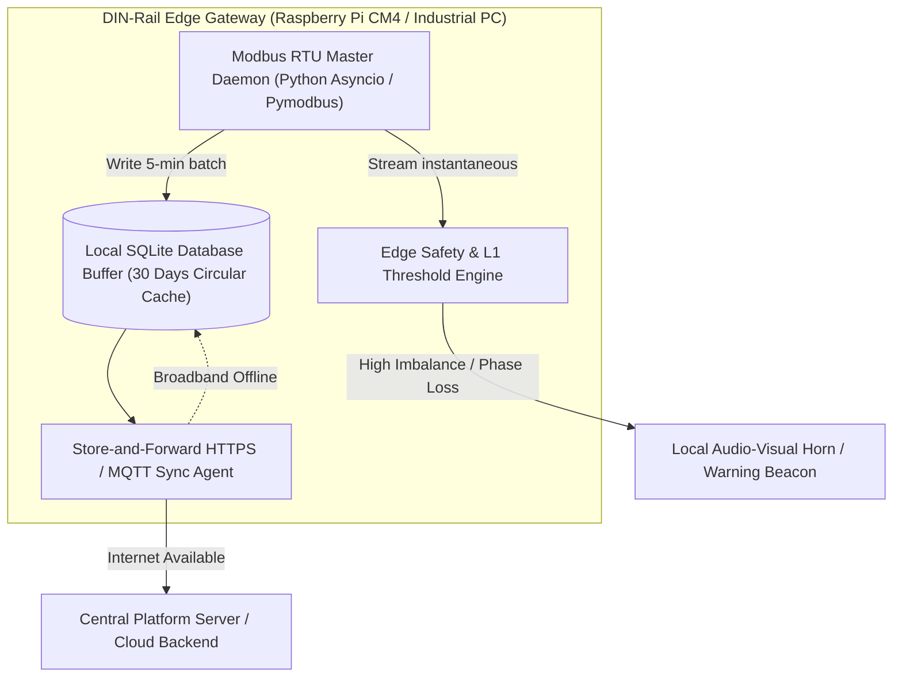

# Shop Floor Edge-to-Cloud Deployment Guide

This document outlines the practical deployment, commissioning, and networking procedure for rolling out the **Factory Energy Intelligence & Optimization Platform** across Indian SME manufacturing plants.

---

## 1. Shop Floor Physical Installation Procedure

### 1.1 Feeder Sub-Metering & CT Installation
1. **Safety Clearance**: Ensure Main Circuit Breaker / Isolator is locked out and tagged out (LOTO) per Indian Electricity Rules (1956) and IS 5216 safety standards.
2. **Current Transformer (CT) Placement**:
   - Install Class 0.5S split-core CTs on the secondary side of each feeder breaker.
   - Orient CT arrow direction from Supply (Busbar) to Load (Equipment terminal).
   - Ensure the CT secondary terminals ($S1, S2$) are connected to the meter before energizing to prevent dangerous open-circuit high-voltage flashovers.
3. **Voltage Tap Connections**:
   - Tap 3-phase line voltages ($R, Y, B$) and Neutral ($N$) from the outgoing terminal block through 2A cartridge backup fuses.
4. **Surface Temperature & Vibration Sensors**:
   - Affix magnetic-base triaxial vibration accelerometers to the motor drive-end (DE) bearing housing.
   - Affix PT100 RTD surface probes with thermally conductive epoxy directly onto the stator casing ribs.

```mermaid
flowchart LR
    Bus["Main 415V Busbar"] --> MCCB["Feeder Breaker (MCCB)"]
    MCCB --> CT["Split-core CTs (Class 0.5S)"]
    CT --> Cable["Feeder Armored Cable"]
    Cable --> Motor["Industrial Motor / Machine"]
    
    CT -->|S1, S2 (2.5 mm²)| Meter["Digital Multi-Function Meter"]
    MCCB -.->|Fused 415V Tap| Meter
    Motor -.->|PT100 RTD| Meter
    
    Meter -->|RS-485 Daisy Chain (Modbus RTU)| Gateway["Industrial Edge Gateway"]
```

---

## 2. RS-485 Modbus RTU Bus Wiring Guidelines

- **Topology**: Strictly linear daisy-chain topology. Do not use star, tree, or ring tapping.
- **Cable Specification**: Shielded twisted-pair (STP) cable, 24 AWG, characteristic impedance $120\ \Omega$.
- **Bus Termination**: Install a $120\ \Omega$ 1/4W termination resistor across lines A (+) and B (-) at both extreme ends of the daisy chain to eliminate signal reflections.
- **Node Addressing**: Assign unique Modbus slave addresses (`ID: 1` to `ID: 8`) to each feeder meter with standard communication settings: `9600 baud, 8 data bits, no parity, 1 stop bit (9600-8-N-1)`.

---

## 3. Industrial Edge Gateway Architecture & Offline Resilience

The edge gateway operates in low-connectivity SME clusters (e.g. Bhosari, Peenya, Pithampur) where broadband is intermittent.



### Store-and-Forward Guarantees
- The local SQLite buffer retains up to 8,640 records per meter (30 days of 5-minute telemetry).
- When internet connectivity drops, the gateway continues logging locally without data loss.
- Upon reconnection, the synchronization agent batches records with unique transaction UUIDs, ensuring zero duplication at the central server.

---

## 4. Software Stack Deployment

### Local Edge Server Deployment (Single Factory Mode)
```bash
# 1. Clone repository on local edge PC
git clone https://github.com/your-org/smart-manufacturing-energy.git
cd smart-manufacturing-energy

# 2. Set up virtual environment
python -m venv .venv
source .venv/bin/activate  # Or on Windows: .venv\Scripts\activate
pip install -r requirements.txt

# 3. Initialize pipeline and baseline database
python scripts/run_pipeline.py

# 4. Start FastAPI Backend Service (Port 8000)
uvicorn backend.api.main:app --host 0.0.0.0 --port 8000 --reload &

# 5. Launch Local Streamlit Dashboard (Port 8501)
streamlit run dashboard/app.py --server.port 8501 --server.address 0.0.0.0
```

---

## 5. Security & Isolation Guidelines

- **Air-Gapped Operation**: The edge gateway can operate entirely within the factory Local Area Network (LAN) without exposing ports to the public internet.
- **Read-Only Metering**: Modbus communication uses Function Code 03 (`Read Holding Registers`) and Function Code 04 (`Read Input Registers`). The platform does not write to breaker trip coils over the network, eliminating cybersecurity risks of remote machine manipulation.
