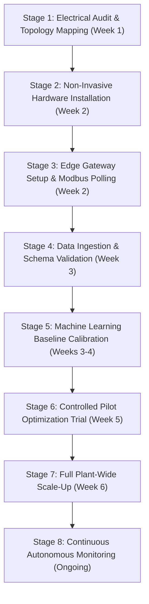

# Factory Energy Intelligence & Optimization Platform
## Industrial Turnkey Deployment Plan

**Target Facility:** Indian SME Discrete / Batch Manufacturing Plants  
**Document Version:** 1.0 (Frozen Release)  
**Standard Turnkey Timeline:** 4 to 6 Weeks from Contract Execution to Audited Savings Verification  

---

## 1. Eight-Stage Structured Implementation Methodology

The platform is deployed through an 8-stage phased implementation engineered to minimize factory disruption and eliminate unplanned production shutdowns:



---

## 2. Stage-by-Stage Implementation Matrix

### Stage 1: Electrical Audit & Topology Mapping
- **Objective:** Map single-line diagram (SLD), inspect main bus and feeder cable sizes, verify transformer rating (kVA), evaluate utility tariff structure (MSEDCL HT-1), and select critical monitoring nodes.
- **Technology Applied:** Handheld clamp-on power analyzer (Fluke 435-II), infrared thermal imager (FLIR E5), cable sizing tables (IS 7098).
- **Physical Output:** Plant electrical single-line schematic, feeder schedule table, and approved sensor installation plan.
- **Approximate Duration:** 3 Days *(Empirical SME average)*.
- **Required Personnel:** 1 Certified Energy Auditor (BEE accredited), 1 Plant Electrical Supervisor.

### Stage 2: Non-Invasive Hardware Installation
- **Objective:** Install 8 digital smart energy meters, 24 split-core CTs, surface PT100 temperature probes, and 3-axis vibration sensors without shutting down plant operations.
- **Technology Applied:** Split-core current transformers (snap-on installation around live feeder cables), shielded twisted-pair Belden 9841 cabling, magnetic RTD mounting studs, stud-mount accelerometers.
- **Physical Output:** Fully wired instrumentation enclosure (IP65) with daisy-chained RS485 serial communication bus.
- **Approximate Duration:** 2 Days *(Weekend shift / non-productive hours preferred)*.
- **Required Personnel:** 2 Licensed Industrial Electricians, 1 Electrical Technician.

### Stage 3: Edge Gateway Deployment & Network Setup
- **Objective:** Install DIN-rail industrial edge gateway, terminate RS485 communication trunk, configure Modbus RTU slave IDs (1 to 8), and set up local LAN connectivity.
- **Technology Applied:** Advantech WISE-710 / Raspberry Pi CM4 Industrial (Linux OS, Python 3 runtime), 24V DC DIN power supply, local WiFi router or unmanaged Ethernet switch.
- **Physical Output:** Operational edge gateway logging 5-minute telemetry packets to local SQLite ring buffer.
- **Approximate Duration:** 1 Day.
- **Required Personnel:** 1 Embedded IoT Systems Engineer.

### Stage 4: Data Integration & Schema Validation
- **Objective:** Verify telemetry data integrity, check phase rotation (RYB), calibrate CT transformation ratios (e.g., 200/5A, 400/5A), and establish daily production data link.
- **Technology Applied:** Modbus polling daemon, automated range validation checker ($300\text{V} \le V \le 480\text{V}$, $P \ge 0$), ERP CSV ingestion endpoint.
- **Physical Output:** Zero-NaN, non-negative, calibrated 5-minute telemetry stream verified against utility border meter.
- **Approximate Duration:** 3 Days.
- **Required Personnel:** 1 Data / Software Engineer, 1 Plant Production Clerk.

### Stage 5: Baseline Calibration & Model Training
- **Objective:** Collect nominal operating telemetry under normal production shifts, fit L2-regularized Ridge regression models ($R^2 \ge 0.98$), establish dynamic expected energy envelopes, and calibrate ISO 10816 vibration thresholds.
- **Technology Applied:** Scikit-learn Ridge regression solver ($\alpha=1.0$), temporal incident clustering engine.
- **Physical Output:** Production-normalized expected energy baseline models stored in local configuration files.
- **Approximate Duration:** 7 to 10 Days *(Assumed minimum window to capture day/night and weekend shifts)*.
- **Required Personnel:** 1 Energy Systems / ML Engineer.

### Stage 6: Pilot Optimization & Operator Training
- **Objective:** Implement idle compressor shutoff routines and pilot maintenance SOP (`REC-001` motor bearing regreasing); train shift operators on dashboard alert acknowledgment.
- **Technology Applied:** Digital relay output / dry contact interlock, Streamlit operator interface.
- **Physical Output:** First verified reductions in idle energy consumption and restored machine power factor.
- **Approximate Duration:** 5 Days.
- **Required Personnel:** 1 Energy Engineer, 2 Shift Supervisors, Maintenance In-Charge.

### Stage 7: Plant-Wide Optimization & Tariff Shifting
- **Objective:** Activate three-tier optimization across all 7 feeders: automate lunch break compressor cutoffs, reschedule induction furnace batch heating to night off-peak slot (₹5.20/kWh), and verify strict throughput preservation.
- **Technology Applied:** Constrained optimization solver enforcing $\sum Q_{\text{opt}} \equiv \sum Q_{\text{base}}$.
- **Physical Output:** Plant-wide SEC reduction of 16.73% and monthly power bill cut of ₹ 3,61,588 verified.
- **Approximate Duration:** 7 Days.
- **Required Personnel:** 1 Lead Energy Architect, Plant Operations Manager.

### Stage 8: Continuous Autonomous Monitoring & Review
- **Objective:** Continuous 24/7 autonomous condition monitoring, monthly automated MSEDCL tariff audit reports, and quarterly model retraining.
- **Technology Applied:** Automated health index scoring, periodic SQLite log rotation, optional cloud sync.
- **Physical Output:** Ongoing monthly electricity savings, quarterly executive review reports.
- **Approximate Duration:** Ongoing operational service.
- **Required Personnel:** Plant Maintenance Team (Daily), Antigravity Field Engineer (Quarterly).

---

## 3. Adapting to Indian SME Brownfield Constraints

```
┌────────────────────────────────────────────────────────────────────────────────────────┐
│                        BROWNFIELD CHALLENGE VS. ENGINEERING FIX                        │
├────────────────────────────┬───────────────────────────────────────────────────────────┤
│ BROWNFIELD CHALLENGE       │ TECHNICAL SOLUTION APPLIED                                │
├────────────────────────────┼───────────────────────────────────────────────────────────┤
│ 1. No Plant Downtime       │ Split-core CTs snap around cables without disconnecting   │
│    Permitted               │ busbars or tripping main breakers. Installation during    │
│                            │ standard lunch break or Sunday maintenance shift.         │
├────────────────────────────┼───────────────────────────────────────────────────────────┤
│ 2. Limited / Zero Internet │ Industrial gateway functions 100% autonomously on local   │
│    Connectivity            │ WiFi/LAN. SQLite buffer retains 45 days of uncompressed   │
│                            │ records offline. Zero cloud dependency for core analytics.│
├────────────────────────────┼───────────────────────────────────────────────────────────┤
│ 3. Legacy Equipment        │ Meters measure electrical line supply directly; no digital│
│    (No PLC / Digital Port) │ interfaces required from vintage machines. External PT100 │
│                            │ and vibration sensors mount via magnetic / adhesive pads. │
├────────────────────────────┼───────────────────────────────────────────────────────────┤
│ 4. Manual Production Logs  │ Shopfloor operators input shift piece counts via a 3-tap  │
│    (Paper Job Cards)       │ touch UI on any shopfloor tablet, or upload daily CSVs.   │
├────────────────────────────┼───────────────────────────────────────────────────────────┤
│ 5. No Dedicated IT Team    │ Gateway is a hardened Linux appliance: auto-reboots upon  │
│                            │ power restoration, includes hardware watchdog timer, and   │
│                            │ exposes an intuitive web dashboard with zero setup.       │
└────────────────────────────┴───────────────────────────────────────────────────────────┘
```
