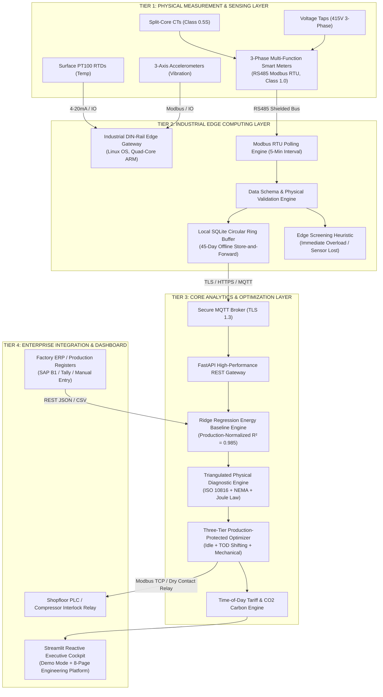
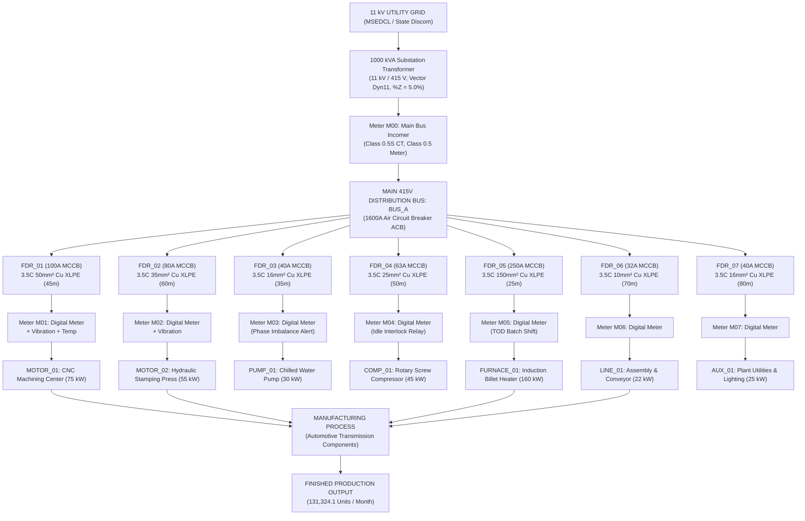
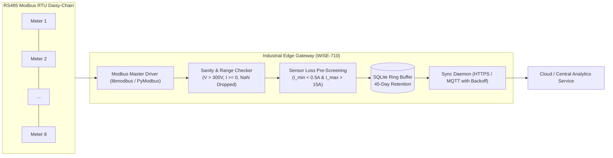
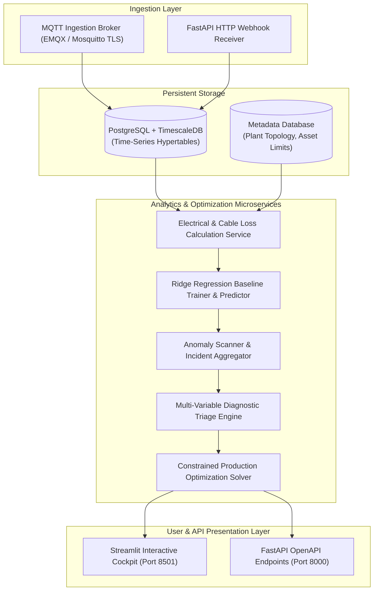
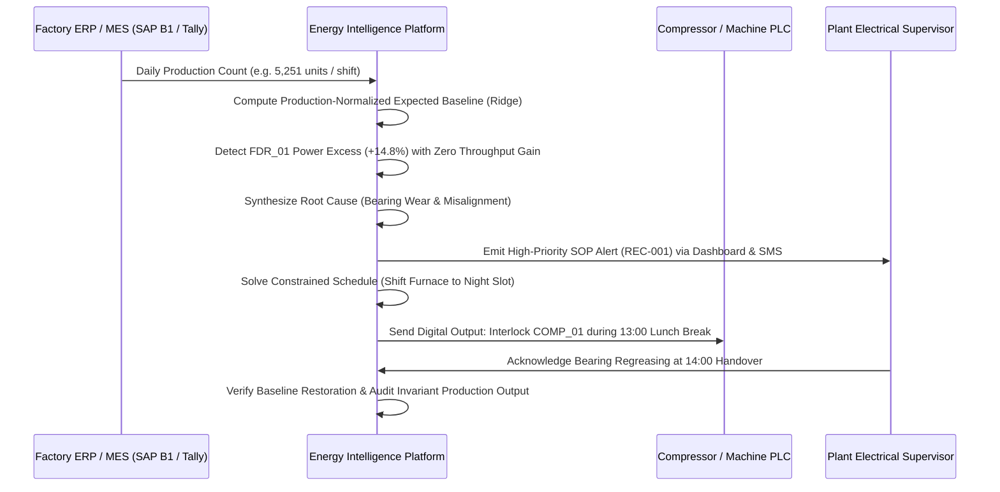

# Factory Energy Intelligence & Optimization Platform
## Final Cyber-Physical System Architecture

**Document Version:** 1.0 (Frozen Release)  
**Target Beneficiary:** Indian SME Manufacturing Facilities (Automotive, Machining, Forging, Plastics)  
**Standard Compliance:** IEC 61557-12 (Power Metering), ISO 50001 (Energy Management), ISO 10816-3 (Vibration Severity), CEA India Grid Standards  

---

## 1. End-to-End System Architecture Overview

The platform uses a modular, four-tier cyber-physical architecture designed for industrial robustness, offline survivability, and low capital expenditure.

---

## 2. Generic SME Plant Electrical Topology

The electrical single-line diagram (SLD) reflects typical Indian SME distribution (11 kV utility grid stepped down to 415 V via a dedicated distribution transformer). Measurements are captured at the main bus and all feeder levels.

---

## 3. Physical Architecture & Hardware Specification

| Hardware Subsystem | Component Description | Specifications | Target Vendor / Cost |
| :--- | :--- | :--- | :--- |
| **Energy Sub-Metering** | 3-Phase Multi-Function Meters (Qty: 8) | True RMS V, I, kW, kVA, kVAR, PF, THD, RS485 Modbus RTU, Class 1.0 | Schneider EasyLogic PM2120 / Selec MFM384 (₹6,500/unit) |
| **Current Sensors** | Split-Core CTs (Qty: 24) | Class 0.5S, 100A to 400A primary, 5A secondary, snap-on retrofittable | Rishabh Instruments / Selec (₹850/unit) |
| **Temperature Sensors** | Surface PT100 RTDs (Qty: 4) | Magnetic surface mount, $-50^\circ\text{C}$ to $+200^\circ\text{C}$, 3-wire Class A | Selec / Radix (₹1,500/unit) |
| **Vibration Sensors** | Industrial Piezoelectric Accelerometers (Qty: 4) | 3-axis velocity RMS ($10\text{–}1000\text{ Hz}$), Modbus / analog output, ISO 10816 compliant | IFM Efector / CTC Industrial (₹3,000/unit) |
| **Edge Gateway** | Industrial DIN-Rail Gateway (Qty: 1) | Quad-Core ARM Cortex-A53, 2GB RAM, 16GB eMMC, Dual RS485, GbE, WiFi, Watchdog | Advantech WISE-710 / Waveshare CM4 (₹22,000) |
| **Enclosure & Cabling** | Industrial Control Panel & Wiring | IP65 sheet steel enclosure, 24V DC DIN power supply, shielded twisted-pair Belden 9841 | Rittal / Polycab (₹24,750) |

---

## 4. Edge Computing Architecture (Offline Survivability)

### Key Edge Characteristics:
1. **Zero-Data-Loss Store-and-Forward:** Telemetry is written immediately to a local SQLite database with indexing on `timestamp` and `machine_id`. If shopfloor WiFi or 4G LTE disconnects for hours or weeks, the gateway continues sampling and logging uninterrupted.
2. **Schema & Sanity Validation:** Raw ADC counts and Modbus registers are converted to IEEE 754 floats and validated against physical domain bounds:
   - $300\text{ V} \le V_{\text{line}} \le 480\text{ V}$
   - $0.0\text{ A} \le I \le 1200\text{ A}$
   - $0.10 \le \text{PF} \le 1.00$
3. **Sensor Loss Pre-Screening:** Edge rule traps open CT loops or disconnected leads (`DATA_QUALITY_CURRENT_SENSOR_LOST`) locally before corrupted numbers propagate upstream.

---

## 5. Cloud & Central Analytics Architecture

---

## 6. Enterprise Integration Architecture

The platform provides bidirectional interfaces for existing SME manufacturing software:

### Integration Protocols:
- **ERP Integration:** REST API endpoint `/api/production/batch` accepts JSON payloads containing piece counts, work order numbers, and rejection rates. Fallback: manual CSV upload on the dashboard.
- **SCADA / PLC Interlocking:** Standard Modbus TCP client on the edge gateway connects directly to Allen-Bradley, Siemens S7-1200, or Delta PLCs to actuate compressor unloader solenoids or HVAC chiller setback relays.
- **Maintenance Alerting:** Webhook dispatch to Telegram, WhatsApp Business API, and automated maintenance ticketing systems.
