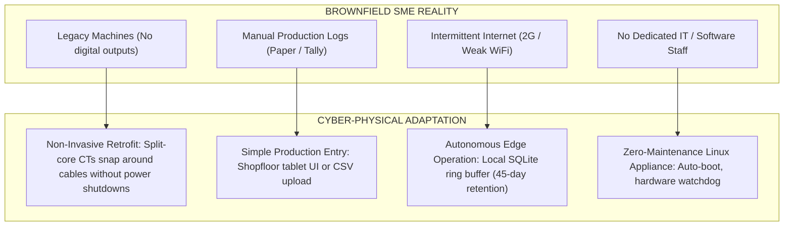

# Factory Energy Intelligence & Optimization Platform
## Final Business Model & SME Commercialization Strategy

**Target Market:** Indian Small & Medium-Sized Enterprises (SMEs) in Discrete & Batch Manufacturing  
**Document Version:** 1.0 (Frozen Release)  
**Economic Assumptions:** Based on audited canonical facility benchmarks (800 kVA contracted demand, MSEDCL HT-1 tariffs)  

---

## 1. Commercial Value Proposition & Market Need

Indian manufacturing SMEs operate under intense margin pressures. Electricity constitutes 15% to 35% of their operating costs, yet over 85% of SMEs possess zero sub-metering infrastructure beyond the utility border meter. 

Traditional enterprise energy management systems (EMS) cost ₹20–50 Lakhs ($>\$25,000$) in upfront licensing, hardware, and integration, requiring 12–24 month payback periods that fail SME capital expenditure criteria.

The **Factory Energy Intelligence Platform** transforms energy management into an accessible operational utility through:
1. **Low Upfront Capital Expenditure:** Turnkey plant hardware starting at just **₹ 1,52,150** ($~\$1,830\text{ USD}$).
2. **Rapid Capital Payback:** Theoretical simple payback of **12.7 days** (~13 days); pragmatic phased payback of **1.8 to 3.5 months**.
3. **High Return on Investment:** Delivers **₹ 41.5 Lakhs** in net cash savings in Year 1 on a ₹19.4 Lakh monthly baseline power bill.
4. **Guaranteed Production Protection:** Enforces strict mathematical throughput preservation ($\Delta Q = 0.0\text{ units}$).

---

## 2. Three Deployment Commercial Tiers

The solution is packaged into three standardized commercial deployment tiers calibrated to the operational maturity and physical scale of Indian manufacturing enterprises:

| Commercial Parameter | TIER 1: PILOT CELL (Single Line / Critical Feeder) | TIER 2: COMPLETE PLANT (Canonical Scenario) | TIER 3: MULTI-SITE ENTERPRISE (Cluster of 3 Facilities) |
| :--- | :---: | :---: | :---: |
| **Physical Scope** | 2 Energy Meters (1 Machining + 1 Compressor) | 8 Energy Meters (Main Bus + 7 Production Feeders) | 24 Energy Meters across 3 Regional Factories |
| **Hardware Subsystems** | 2 Meters, 6 CTs, 1 Mini Gateway, 1 Vibration Sensor | 8 Meters, 24 CTs, 1 Industrial Gateway, 4 Sensors | 24 Meters, 72 CTs, 3 Industrial Gateways, 12 Sensors |
| **Hardware Capex** | ₹ 34,500 | ₹ 1,12,400 | ₹ 3,37,200 |
| **Installation & Wiring** | ₹ 6,000 | ₹ 24,750 | ₹ 74,250 |
| **Setup & Calibration** | ₹ 5,000 | ₹ 15,000 | ₹ 45,000 |
| **Total Turnkey Capex** | **₹ 45,500** *(~$550 USD)* | **₹ 1,52,150** *(~$1,830 USD)* | **₹ 4,56,450** *(~$5,500 USD)* |
| **Annual Software SaaS** | ₹ 12,000 (₹ 1,000 / month) | ₹ 36,000 (₹ 3,000 / month) | ₹ 90,000 (₹ 7,500 / month) |
| **Annual Maintenance Support**| ₹ 4,000 | ₹ 12,000 | ₹ 30,000 |
| **Annual Operating Cost** | **₹ 16,000 / year** | **₹ 48,000 / year** | **₹ 1,20,000 / year** |
| **Expected Monthly Savings** | ₹ 52,000 / month | ₹ 3,61,588 / month | ₹ 10,84,764 / month |
| **Expected Annual Savings** | **₹ 6,24,000 / year** | **₹ 43,39,061 / year** | **₹ 1,30,17,168 / year** |
| **Instantaneous Payback** | **26.8 Days (~27 Days)** | **12.7 Days (~13 Days)** | **12.7 Days (~13 Days)** |
| **Phased Real-World Payback**| **1.5 to 2.5 Months** | **1.8 to 3.5 Months** | **2.0 to 4.0 Months** |
| **Net Year-1 Cash ROI** | **₹ 5,62,500** | **₹ 41,38,911** | **₹ 1,24,40,718** |

---

## 3. Turnkey Plant Cost Model Breakdown (Tier 2 - Master Canonical)

```
┌────────────────────────────────────────────────────────────────────────────────────────┐
│                        TURNKEY PLANT CAPITAL EXPENDITURE (BOM)                         │
├───────────────────────────────────────────────────┬─────┬────────────┬─────────────────┤
│ ITEM DESCRIPTION                                  │ QTY │ UNIT (₹)   │ TOTAL COST (₹)  │
├───────────────────────────────────────────────────┼─────┼────────────┼─────────────────┤
│ 3-Phase Digital Smart Meters (RS485, Class 1.0)   │  8  │ ₹  6,500   │ ₹  52,000       │
│ Class 0.5S Split-Core Current Transformers        │ 24  │ ₹    850   │ ₹  20,400       │
│ Industrial DIN-Rail Edge IoT Gateway (WISE-710)   │  1  │ ₹ 22,000   │ ₹  22,000       │
│ Surface Temperature (PT100) & Vibration Sensors   │  4  │ ₹  4,500   │ ₹  18,000       │
│ IP65 Control Enclosure, Shielded Cabling, 24V PSU │  1  │ ₹ 24,750   │ ₹  24,750       │
│ Installation, Wiring, CT Setup & Commissioning    │  1  │ ₹ 15,000   │ ₹  15,000       │
├───────────────────────────────────────────────────┴─────┴────────────┼─────────────────┤
│ TOTAL TURNKEY CAPITAL EXPENDITURE (CAPEX)                            │ ₹ 1,52,150      │
└──────────────────────────────────────────────────────────────────────┴─────────────────┘
```

---

## 4. SME Deployment Architecture for Indian Brownfield Plants

Indian manufacturing plants frequently feature challenging operating environments. The system is engineered to function reliably under typical brownfield constraints:



### Local Edge Operation + Optional Cloud Synchronization:
- **100% Standalone Mode:** In plants with no broadband connection, the edge gateway hosts the complete web application on the local plant WiFi/Ethernet LAN. Plant managers access the dashboard directly on mobile phones or office laptops via internal IP address (`http://192.168.1.100:8501`).
- **Opportunistic Cloud Sync:** When an internet connection (WiFi or 4G LTE dongle) is detected, the gateway automatically synchronizes compressed, encrypted 5-minute aggregates to the central portal, enabling multi-plant benchmarking.

---

## 5. Architectural Scale-Up Roadmap

The system follows an incremental scaling pathway that de-risks capital allocation for plant owners:

```
[Level 1: Single Machine Pilot]
      │  Monitor 1 CNC spindle or compressor; validate baseline and idle leakage.
      ▼
[Level 2: Production Cell]
      │  Sub-meter 3–5 machines on a single stamping or machining line; compute stage SEC.
      ▼
[Level 3: Full Plant Facility]
      │  Monitor all 8 feeders, transformer secondary, and plant auxiliaries (Canonical Scenario).
      ▼
[Level 4: Multi-Site Enterprise]
      │  Interconnect plants across regional industrial corridors (Pune, Sanand, Chennai).
      ▼
[Level 5: SME Cluster Intelligence Platform]
         Aggregated benchmark database comparing SEC across industry peer groups.
```

---

## 6. Competitive Differentiation & Functional Synergy

The platform does not rely on vague marketing assertions like *"nobody else does this."* Its defensible competitive advantage lies in the **functional integration of six disciplines** that are usually fragmented across separate, disconnected vendor silos:

```
┌────────────────────────────────────────────────────────────────────────────────────────┐
│                        COMPETITIVE FUNCTIONAL COMBINATION                              │
├────────────────────────────────────────────────────────────────────────────────────────┤
│ 1. ELECTRICAL INTELLIGENCE  : True RMS 3-phase vector power, PF, NEMA unbalance, losses│
│ 2. PRODUCTION AWARENESS     : Dynamic Ridge regression expected baseline (R² = 0.985)  │
│ 3. MACHINE DIAGNOSTICS      : ISO 10816 vibration + thermal rise physical triangulation│
│ 4. TARIFF ARBITRAGE         : Automated Time-of-Day (TOD) peak-to-offpeak load shifting│
│ 5. PRODUCTION CONSTRAINT    : Hard mathematical constraint: ΔQ = 0.0 units guaranteed  │
│ 6. SAVINGS VERIFICATION     : Decoupled before-vs-after physical vs financial audit    │
└────────────────────────────────────────────────────────────────────────────────────────┘
```

### The Closed-Loop Operational Cycle:
$$\mathbf{DETECT} \longrightarrow \mathbf{DIAGNOSE} \longrightarrow \mathbf{RECOMMEND} \longrightarrow \mathbf{OPTIMIZE} \longrightarrow \mathbf{VERIFY}$$

By executing this complete loop within a unified, affordable cyber-physical tool, the platform provides actionable manufacturing intelligence rather than passive data visualization.
