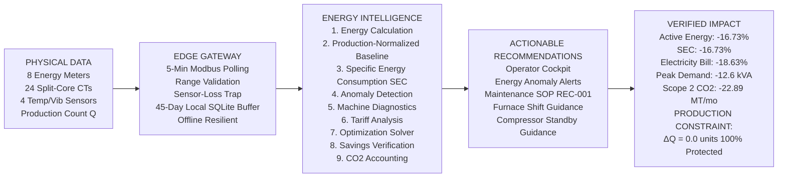

# Digital Intelligence & Analytics Architecture
## Factory Energy Intelligence & Optimization Platform

**Document Identifier:** `final_digital_architecture.md`  
**Core Function:** Cyber-Physical Energy Intelligence, Asset Condition Monitoring, and Decision Support  
**Operational Loop:** DETECT ➔ DIAGNOSE ➔ RECOMMEND ➔ OPTIMIZE ➔ VERIFY  
**Deployment Concept:** Retrofit digital intelligence onto existing brownfield manufacturing infrastructure  
**Release State:** Engineering Model Frozen (v1.0-RC1)  

---

## 1. Digital Intelligence & Processing Flow (Detailed Architecture)

This diagram details the cyber-physical data flow from physical instruments, through local edge processing, into the nine modular analytics engines, and out to actionable operator decision support and audited savings verification.

```mermaid
flowchart TD
    %% ==========================================
    %% LAYER 1: PHYSICAL DATA SOURCES
    %% ==========================================
    subgraph L1[1. PHYSICAL DATA SOURCES - Retrofitted Instrumentation]
        MTRS[8 Digital Energy Meters - RS485 Modbus RTU<br/>3-Phase Voltages, Phase Currents via 24 Split-Core CTs, Power Factor]
        SENS[Physical Asset Sensors<br/>Surface Temperature PT100 RTDs, 3-Axis Vibration Velocity RMS]
        PROD_IN[Production Data Feed<br/>Finished Component Count Q via Shopfloor Web Form / CSV]
        OPT_EXT[Optional Enterprise Interfaces<br/>Existing PLC/SCADA via Modbus TCP, ERP/MES via REST API]
    end

    %% ==========================================
    %% LAYER 2: INDUSTRIAL EDGE GATEWAY
    %% ==========================================
    subgraph L2[2. INDUSTRIAL EDGE GATEWAY - WISE-710 / Linux Appliance]
        ACQ[Modbus / RS485 / Ethernet Master Polling Engine - 5-Min Telemetry]
        VAL[Data Cleaning & Range Validation - Bounds: 300V-480V, I >= 0, NaN Drop]
        TRAP[Sensor-Loss Trap - I_min < 0.5A & I_max > 15A: Suppress False Alarms]
        BUF[Local Circular Ring Buffer - SQLite Storage: 45-Day Retention]
        OFFLINE[Autonomous Offline Operation - Full Functionality during Internet Outages]

        MTRS --> ACQ
        SENS --> ACQ
        PROD_IN --> ACQ
        OPT_EXT -. Optional Feed .-> ACQ
        ACQ --> VAL
        VAL --> TRAP
        TRAP --> BUF
        BUF --> OFFLINE
    end

    %% ==========================================
    %% LAYER 3: DATA & ANALYTICS LAYER
    %% ==========================================
    subgraph L3[3. DATA & ANALYTICS ENGINE - Nine Processing Modules]
        M1[Module 1: Electrical Energy Calculation<br/>P, Q, S vectors, Discrete 5-min kWh integration, Cable I²R loss]
        M2[Module 2: Production-Normalized Baseline<br/>Production-Normalized Expected Power & Energy Envelopes]
        M3[Module 3: Specific Energy Consumption SEC<br/>SEC = kWh / Units Manufactured - Division-by-Zero Protected]
        M4[Module 4: Anomaly Detection Engine<br/>Statistical residuals > 12%, NEMA unbalance, low PF, alert clustering]
        M5[Module 5: Physical Diagnostic Engine<br/>Triangulates electrical balance, thermal rise, and ISO 10816 vibration]
        M6[Module 6: Time-of-Day Tariff Engine<br/>MSEDCL HT-1 slots: Off-Peak ₹5.20, Normal ₹7.80, Peak ₹11.50]
        M7[Module 7: Three-Tier Optimization Solver<br/>Idle elimination + TOD peak load shifting + mechanical restoration]
        M8[Module 8: Savings Verification Engine<br/>Decouples physical energy delta from tariff economic arbitrage]
        M9[Module 9: Carbon Accounting Engine<br/>CEA India v19 grid emission factor: 0.716 kg CO2 / kWh]

        OFFLINE --> M1
        M1 --> M2
        M2 --> M3
        M3 --> M4
        M4 --> M5
        M5 --> M6
        M6 --> M7
        M7 --> M8
        M8 --> M9
    end

    %% ==========================================
    %% LAYER 4: DECISION & ACTION LAYER
    %% ==========================================
    subgraph L4[4. DECISION & ACTION SUPPORT LAYER - Operator Guidance]
        DASH[Streamlit Operations Cockpit<br/>Hackathon Demo Mode + Full 8-Page Diagnostic Platform]
        ALERTS[Diagnostic Energy Alerts<br/>Unexplained power surge, standby compressor idle waste, unbalance]
        SOPS[Actionable Maintenance SOPs<br/>REC-001: Bearing regreasing & laser alignment - Saves ₹29,520/mo]
        SCHED[Intelligent Production Scheduling Recommendations<br/>Reschedule 160 kW furnace to night off-peak slot - Saves ₹93,619/mo]

        M9 --> DASH
        DASH --> ALERTS
        DASH --> SOPS
        DASH --> SCHED
    end

    %% ==========================================
    %% LAYER 5: VERIFICATION & AUDIT LAYER
    %% ==========================================
    subgraph L5[5. AUDITED VERIFICATION & PRODUCTION GUARANTEE]
        PROD_GUARD[PRODUCTION CONSTRAINT AUDIT<br/>Baseline Output: 131,324.1 units | Optimized Output: 131,324.1 units<br/>Constraint: ΔQ = 0.0 units - 100% PRESERVED, NEVER THROTTLED]
        AUDIT_GRID[Master Audited Before vs After Impact Grid<br/>Active Energy: 191,139 to 159,166 kWh -16.73%<br/>Specific Energy SEC: 1.4555 to 1.2120 kWh/u -16.73%<br/>Electricity Bill: ₹19,40,446 to ₹15,78,857 -18.63%<br/>Peak Demand Shaved: 462.7 to 450.1 kVA -12.6 kVA<br/>Scope 2 Carbon: 136.85 to 113.96 MT CO2 -22.89 MT/mo]
        ROI_BOX[SME Commercial Return on Investment<br/>Turnkey Capex: ₹ 1,52,150 ~$1,830 USD<br/>Instantaneous Payback: 12.7 Days ~13 Days<br/>Pragmatic Phased Industrial Payback: 1.8 to 3.5 Months<br/>Net Year-1 ROI: ₹ 41,50,911 - 27.3x Capex Multiple]

        DASH --> PROD_GUARD
        PROD_GUARD --> AUDIT_GRID
        AUDIT_GRID --> ROI_BOX
    end
```

---

## 2. PPT-Ready Compact Digital Architecture (Horizontal Slide Flow)

A clean left-to-right presentation flow designed specifically for executive slides:



---

## 3. Nine Core Analytics Processing Modules

| Module Number | Analytics Engine Name | Core Technical Formulation | Primary Output Data |
| :---: | :--- | :--- | :--- |
| **Module 1** | **Electrical Energy Calculation** | $P = \sqrt{3} V I \cos\phi$; $S = \sqrt{3} V I$; $E = P \cdot \Delta t$; $P_{\text{loss}} = 3 I^2 R(50^\circ\text{C})$ | 5-minute kWh, kVA, PF, Cable losses |
| **Module 2** | **Production-Normalized Baseline** | $E_{\text{expected}} = \beta_0 + \beta_1 Q + \sum \beta_j X_j$ via $L_2$ Ridge ($\alpha=1.0$) | Dynamic expected power & energy baseline |
| **Module 3** | **Specific Energy Consumption** | $\text{SEC} = \frac{E_{\text{actual}}}{Q_{\text{prod}}}$; returns `None` when $Q \le 0$ | $k\text{Wh}/\text{unit}$ manufactured (Protected) |
| **Module 4** | **Anomaly Detection Engine** | Residual $\Delta P = \frac{P - P_{\text{exp}}}{P_{\text{exp}}} > 12\%$; NEMA unbalance $> 12\%$ | Clustered diagnostic incident episodes |
| **Module 5** | **Physical Diagnostic Engine** | Decision tree: ISO 10816 vibration ($>2.8\text{ mm/s}$) + $\Delta T > 10^\circ\text{C}$ + PF | Triangulated physical root cause |
| **Module 6** | **Time-of-Day Tariff Engine** | MSEDCL HT-1: Off-Peak ₹5.20, Normal ₹7.80, Peak ₹11.50 | Billing period costs & demand charges |
| **Module 7** | **Three-Tier Optimization Solver** | $\min \text{Cost}$ s.t. $\sum Q_{\text{opt}} \equiv \sum Q_{\text{base}}$ & $S_{\text{max}} \le 800\text{ kVA}$ | Optimal scheduling recommendations |
| **Module 8** | **Savings Verification Engine** | Decouples physical energy delta ($\Delta E$) from tariff arbitrage delta | Audited Before vs After verification table |
| **Module 9** | **Carbon Accounting Engine** | $\text{Emissions } [\text{MT}] = \frac{E \cdot 0.716\text{ kg}/\text{kWh}}{1000}$ (CEA v19) | Avoided Scope 2 greenhouse gas emissions |

---

## 4. Brownfield Retrofit Principle & Non-Invasive Decision Support

1. **Intelligence & Decision Support (Not Closed-Loop Machine Control):**
   - The platform operates as an **engineering intelligence, diagnostic, and decision-support tool**.
   - It issues prioritized Standard Operating Procedures (SOPs) and scheduling recommendations to plant engineers and supervisors.
   - It does **not** perform autonomous, closed-loop machine actuation or alter machine control loops, preserving plant safety and warranty coverage.
2. **Brownfield Overlay (No Infrastructure Replacement):**
   - The platform overlays digital sub-metering on top of existing equipment without replacing PLCs, CNC controllers, SCADA systems, or ERP databases.
   - External enterprise interfaces (SCADA Modbus TCP, ERP REST API) are **optional modules**, not prerequisites. If no ERP exists, operators input shift counts via a simple web form.
3. **Offline Edge Autonomy:**
   - The edge gateway (WISE-710) executes all data validation, sensor-loss filtering, and 5-minute aggregations locally.
   - The local SQLite buffer retains up to **45 days** of uncompressed records offline, ensuring uninterrupted intelligence during factory internet outages.
