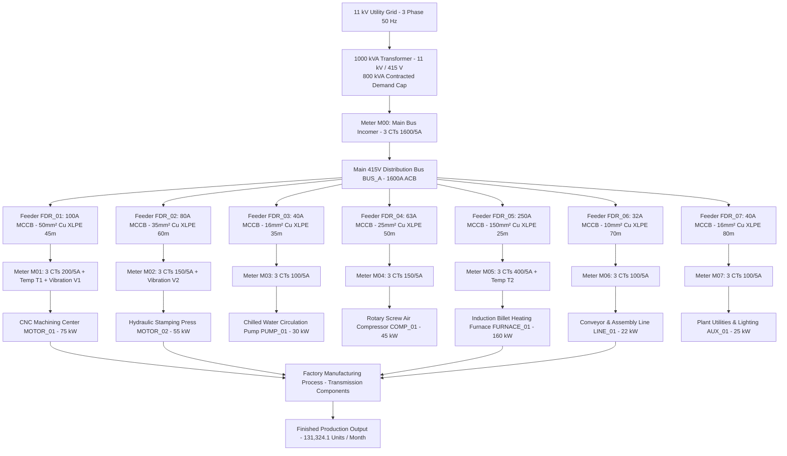
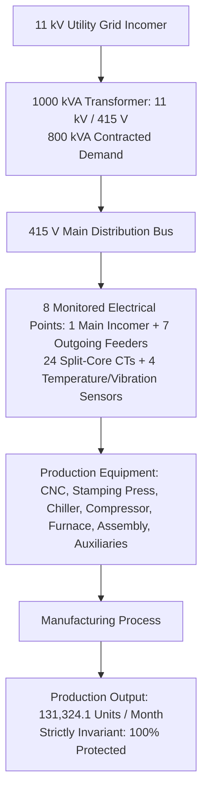

# Physical Plant & Electrical Single-Line Architecture
### Illustrative Canonical SME Factory Configuration (Reference Plant Simulation)
## Factory Energy Intelligence & Optimization Platform

**Document Identifier:** `final_physical_architecture.md`  
**Evaluation Reference:** Apex Precision Components Ltd., Bhosari Industrial Estate, Pune  
**Standard Compliance:** IEC 61557-12 (Power Metering), IS 7098 (Cable Sizing), IEEE 519 (Power Quality)  
**Release State:** Engineering Model Frozen (v1.0-RC1)  

---

## 1. Single-Line Electrical Distribution & Sub-Metering Architecture

This single-line diagram (SLD) details the physical power distribution hierarchy from the 11 kV utility grid incomer down to individual production equipment, indicating where sub-meters, split-core CTs, and physical sensors are installed.

---

## 2. PPT-Ready Simplified Hierarchy (Slide Version)

A streamlined top-down view designed for competition presentation slides:

---

## 3. Tier-2 Turnkey Hardware Bill of Materials (BOM)

The physical architecture strictly corresponds to the frozen Tier-2 deployment scope:

| Electrical Point / Node | Monitored Asset | Equipment Rating | Instrument Type | Current Sensors | Temp / Vibration Sensors |
| :--- | :--- | :---: | :--- | :---: | :---: |
| **Main Incomer** | Main Bus Incomer | 1000 kVA / 1600 A | Meter M00 (Class 0.5) | 3 × 1600/5A CTs | — |
| **Feeder FDR_01** | CNC Machining Center (MOTOR_01) | 75 kW | Meter M01 (Class 1.0) | 3 × 200/5A CTs | Surface PT100 (T1) + Vibration (V1) |
| **Feeder FDR_02** | Hydraulic Stamping Press (MOTOR_02)| 55 kW | Meter M02 (Class 1.0) | 3 × 150/5A CTs | Vibration Sensor (V2) |
| **Feeder FDR_03** | Chilled Water Pump (PUMP_01) | 30 kW | Meter M03 (Class 1.0) | 3 × 100/5A CTs | — |
| **Feeder FDR_04** | Rotary Screw Compressor (COMP_01) | 45 kW | Meter M04 (Class 1.0) | 3 × 150/5A CTs | — |
| **Feeder FDR_05** | Induction Billet Furnace (FURNACE_01)| 160 kW | Meter M05 (Class 1.0) | 3 × 400/5A CTs | Surface PT100 (T2) |
| **Feeder FDR_06** | Conveyor & Assembly (LINE_01) | 22 kW | Meter M06 (Class 1.0) | 3 × 100/5A CTs | — |
| **Feeder FDR_07** | Plant Utilities & Lighting (AUX_01) | 25 kW | Meter M07 (Class 1.0) | 3 × 100/5A CTs | — |
| **Edge Gateway** | Industrial Gateway (WISE-710) | — | 1 Industrial Unit | — | — |
| **TOTALS** | **Tier-2 Turnkey Scope** | — | **8 Energy Meters** | **24 Split-Core CTs** | **4 Sensors (2 Temp + 2 Vibration)** |

**Total Turnkey Hardware Capex:** **₹ 1,52,150** ($~\$1,830\text{ USD}$, including IP65 enclosure, shielded cabling, and electrical contractor commissioning).

---

## 4. Key Physical Engineering Parameters & Defensibility Notes

1. **1000 kVA Transformer vs. 800 kVA Contracted Demand:**
   - **1000 kVA Transformer Physical Capacity:** Standard oil-cooled Dyn11 substation unit providing thermal capacity for simultaneous machine startup inrush currents (5–7× rated current).
   - **800 kVA Sanctioned Contract Demand:** The commercial contract ceiling with the utility (MSEDCL HT-1 tariff). 
   - Both figures are engineering-consistent: transformer capacity is deliberately specified 20% to 25% above contract demand to avoid equipment overheating while respecting contract demand limits.
2. **Brownfield Non-Invasive Retrofit:**
   - All 24 current transformers are **split-core snap-on** units installed around existing feeder cables without busbar disconnection or plant shutdowns.
3. **Illustrative Reference Factory Context:**
   - The equipment names (`MOTOR_01`, `FURNACE_01`, etc.) represent the canonical benchmark facility used to evaluate the platform.
   - Operating ranges and load factors are calibrated against empirical industrial field reference data (Reliance Industries Limited / textile & precision engineering telemetry).
